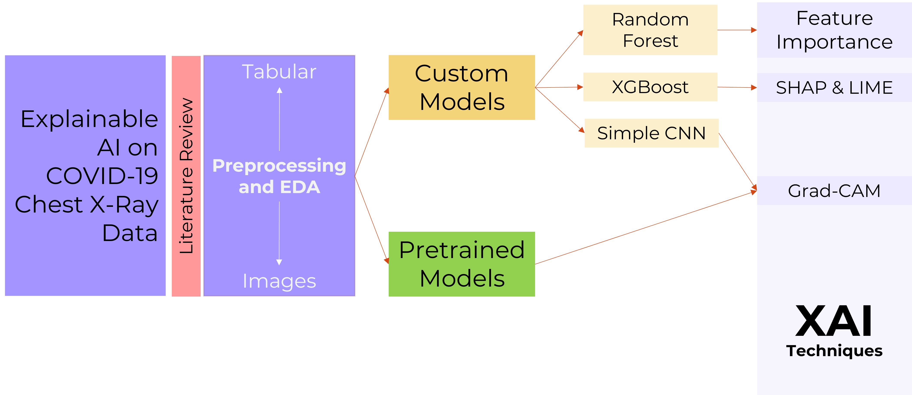

# Explainable AI on COVID-19 Chest X-Ray Tabular and Image Data

[](https://www.python.org/)
[](https://jupyter.org/)
[](LICENSE)

This repository contains a curated portfolio version of an academic project developed for the **Large-Scale Media Analytics** course at **Universidad Politécnica de Madrid**.

The project studies how explainable AI techniques can be applied to COVID-19 chest X-ray data and associated clinical metadata. It combines metadata preprocessing, exploratory data analysis, clinical-note feature engineering, classical machine learning, a simple convolutional neural network, and interpretability methods such as **feature importance**, **SHAP**, **LIME**, and **Grad-CAM**.

> **Important:** this repository is an educational and research-oriented XAI case study. It is **not** a clinical diagnostic tool and does not claim clinical-grade diagnostic performance.

---

## Project Overview

The objective of this project was to analyze a real-world medical imaging dataset and study how different machine learning models behave when trained on noisy, imbalanced, and artifact-prone chest X-ray data.

The project includes:

- preprocessing of chest X-ray metadata and image files;
- exploratory data analysis of class distribution, sex, age, view type, and image counts per patient;
- manual artifact annotation to detect possible visual shortcuts such as overlaid text or medical devices;
- tabular classification using **Random Forest** and **XGBoost**;
- clinical-note processing with **TF-IDF** features;
- image classification with a simple **CNN** baseline;
- explainability analysis using **feature importance**, **SHAP**, **LIME**, and **Grad-CAM**;
- contextual review of external open-source chest X-ray models and pretrained tools.

---

## Motivation

Machine learning models trained on medical imaging data can learn clinically meaningful patterns, but they can also exploit dataset-specific shortcuts such as acquisition markers, overlaid text, hospital-specific formatting, or medical devices. This is especially relevant in heterogeneous public medical datasets.

For that reason, this project does not focus only on predictive performance. Its main goal is to explore how XAI methods can help inspect model behavior, identify possible biases, and evaluate whether the learned signal is medically plausible.

---

## Dataset

The project was based on the **COVID-19 Chest X-ray Dataset** by Cohen et al.:

- GitHub: <https://github.com/ieee8023/covid-chestxray-dataset>
- Kaggle mirror/reference: <https://www.kaggle.com/datasets/awsaf49/covid19-xray-dataset>

The dataset itself is **not redistributed** in this repository. Please download it from the original source and review its license before use.

The original dataset repository states that each image has its own license specified in `metadata.csv`, while metadata, scripts, and other documents are released under **CC BY-NC-SA 4.0**. For this reason, this portfolio repository only includes project code, documentation, and a small manually created artifact annotation CSV.

Expected local placement after download:

```text
xai-covid-cxr-tabular-image/
└── data/
    └── covid-chestxray-dataset/
        ├── metadata.csv
        └── images/
```

Some notebook cells may generate or expect preprocessed images under:

```text
data/covid-chestxray-dataset/images_preproc/
```

If needed, adjust paths in the notebook depending on where you place the dataset locally.

---

## Project Workflow

The project follows a bias-aware explainable AI pipeline for COVID-19 chest X-ray analysis. It combines metadata preprocessing, exploratory data analysis, custom baseline models, pretrained model review, and interpretability methods for both tabular and image data.



The workflow is organized into two main branches:

- Tabular data: patient metadata and clinical-note features were used to train interpretable machine learning baselines such as Random Forest and XGBoost.
- Image data: chest X-ray images were processed and analyzed with a simple CNN baseline and pretrained chest X-ray models for comparison and interpretability exploration.

The final explainability layer includes feature importance, SHAP, LIME and Grad-CAM to inspect model behavior and identify potential shortcut learning from non-clinical artifacts.

---

## Repository Structure

```text
xai-covid-cxr-tabular-image/
│
├── README.md
├── requirements.txt
├── .gitignore
├── LICENSE
│
├── notebooks/
│   └── explainable_ai_covid_cxr.ipynb
│
├── data/
│   ├── README.md
│   └── artifact_annotations.csv
│
├── docs/
│   ├── attribution.md
│   ├── methodology.md
│   └── project_summary.md
│
└── figures/
    ├── project_workflow.png
    ├── class_distribution.png
    ├── manual_artifact_annotation_summary.png
    ├── metadata_missing_values.png
    ├── random_forest_feature_importance.png
    ├── shap_feature_impact.png
    └── top_diagnostic_findings.png

```

---

## Methodology

### 1. Metadata and Image Preprocessing

The raw dataset combines metadata and imaging data from heterogeneous sources. The preprocessing stage cleaned the metadata, removed irrelevant or incomplete fields, filtered non-useful diagnoses, and standardized the image files for downstream analysis.

The working dataset was represented both at image level and patient level to support exploratory analysis and reduce the risk of patient-level information leakage.

### 2. Exploratory Data Analysis

The EDA focused on:

- diagnosis distribution;
- age and sex distribution by class;
- X-ray view type distribution;
- number of images per patient;
- diagnosis transitions across multiple images from the same patient;
- clinical-note word clouds;
- potential non-lung artifacts in images.

A small manual annotation file was created to flag visible artifacts such as text overlays and medical devices.

### 3. Tabular Modeling

Two classical machine learning models were trained on structured metadata and processed clinical notes:

- Random Forest Classifier;
- XGBoost Classifier.

The tabular feature set included age, sex, X-ray view type, and TF-IDF features extracted from cleaned clinical notes.

### 4. Image Modeling

A simple CNN was trained as a baseline image classifier. The purpose was not to obtain state-of-the-art diagnostic performance, but to create an interpretable experimental setup for Grad-CAM visualizations.

### 5. Explainable AI

The project applied different XAI techniques depending on the data modality:

- Random Forest feature importance for global tabular interpretability;
- SHAP for global and local feature attribution;
- LIME for local tabular explanations;
- Grad-CAM for visual explanations on chest X-ray images.

### 6. External Model Review

The project also reviewed external open-source models and libraries for thoracic disease classification, including TorchXRayVision and other published architectures. These models are discussed as contextual references or pretrained baselines, not as models trained from scratch in this project.

---

## Selected Visual Outputs

The repository can include selected non-sensitive visual outputs under `assets/figures/`, such as:

- diagnostic label distribution;
- metadata missing-value analysis;
- manual artifact annotation summary;
- class distribution after label simplification;
- Random Forest feature importance;
- SHAP feature impact plots.

Raw chest X-ray images and Grad-CAM overlays are intentionally not included as repository assets because image-level licenses vary in the original dataset. The original academic slide deck is not redistributed in this repository because it contains chest X-ray examples from the source dataset. To avoid redistributing medical images with mixed per-image licensing, this repository only includes derived plots and documentation.

---

## Main Results

The tabular models achieved stronger baseline performance than the simple CNN, especially for the majority classes. However, the results should be interpreted cautiously because of class imbalance, dataset heterogeneity, possible acquisition artifacts, and the limited size of some classes.

The XAI analysis highlighted why interpretability is critical in medical imaging: models may rely on medically meaningful lung regions, but they can also be affected by shortcuts such as text overlays, acquisition markers, or device artifacts.

---

## Limitations

This project has several important limitations:

- the dataset is small and heterogeneous;
- class imbalance is substantial, especially for the Normal class;
- some images contain visible artifacts that may bias model behavior;
- patient-level splitting must be handled carefully to avoid leakage;
- no clinical validation was performed;
- the CNN is a simple educational baseline, not a production-grade medical imaging model;
- external models reviewed in the project were not trained from scratch by the authors.

---

## How to Run

1. Clone this repository:

```bash
git clone https://github.com/JuanMallodelaCalle/xai-covid-cxr-tabular-image.git
cd xai-covid-cxr-tabular-image
```

2. Create and activate a virtual environment:

```bash
python -m venv .venv
```

On Windows PowerShell:

```powershell
.\.venv\Scripts\Activate.ps1
```

On macOS/Linux:

```bash
source .venv/bin/activate
```

3. Install dependencies:

```bash
pip install -r requirements.txt
```

4. Download the dataset from the original source and place it under:

```text
data/covid-chestxray-dataset/
```

5. Open the notebook:

```bash
jupyter notebook notebooks/explainable_ai_covid_cxr.ipynb
```

---

## Attribution

Original academic project developed by **Juan Mallo de la Calle** and **Jesús Rincón Laguarta** for the **Large-Scale Media Analytics** course.

This repository is a curated portfolio version maintained by **Juan Mallo de la Calle**. See [`docs/attribution.md`](docs/attribution.md) for more details.

---

## References

- Cohen, J. P., Morrison, P., Dao, L., Roth, K., Duong, T. Q., & Ghassemi, M. **COVID-19 Image Data Collection**. <https://github.com/ieee8023/covid-chestxray-dataset>
- TorchXRayVision. <https://github.com/mlmed/torchxrayvision>

---

## License Scope

The MIT license in this repository applies only to the code, documentation, and derived project materials included here. It does not apply to the external COVID-19 Chest X-ray Dataset or to any medical images downloaded from third-party sources. Users must review and comply with the original dataset licenses before using or redistributing any external data.

---

## Disclaimer

This repository is for educational and portfolio purposes only. It must not be used for clinical decision-making, diagnosis, triage, or medical deployment.
